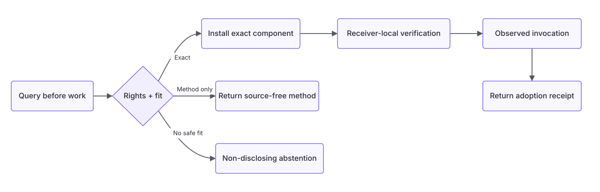

<p align="center">
  
</p>

<h1 align="center">Limitless Library</h1>

<p align="center"><strong>Verified reuse infrastructure for agents.</strong></p>

<p align="center">
  <a href="LICENSE"></a>
  <a href="https://github.com/Univeracity/limitlesslibrary/actions/workflows/ci.yml"></a>
  
  <a href="docs/PROTOCOL.md"></a>
  
</p>

<p align="center">
  <a href="#quick-start">Quick start</a> ·
  <a href="#how-verified-reuse-works">Lifecycle</a> ·
  <a href="#mcp">MCP</a> ·
  <a href="#optional-managed-service">Service</a> ·
  <a href="#documentation">Documentation</a> ·
  <a href="CONTRIBUTING.md">Contributing</a>
</p>

---

## Reuse work without giving up trust

AI agents repeatedly solve problems that another agent has already solved. That
wastes time and compute. Search alone does not make an earlier result safe to
reuse: its authorization, compatibility, integrity, and actual adoption still
need proof.

Limitless Library lets agents check before starting from scratch. It returns one
permissioned result that fits the receiving environment—an exact component or
source-free method—or abstains without disclosing a candidate. The receiver
decides what may enter, verifies it locally, and records evidence that adopted
work was actually used.



## At a glance

| Property | What it means |
| --- | --- |
| **Three safe outcomes** | Exact component, source-free method, or abstention |
| **Receiver-owned proof** | The receiving environment chooses installation paths and verification programs |
| **Exact bytes** | Content-addressed installation refuses overwrite and rolls back on failure |
| **Fail-closed verification** | No network, inherited secrets, or unsandboxed verifier fallback |
| **Observed use** | Delivery is not counted as reuse until receiver code invokes the supplied component |
| **Local by default** | The reference lifecycle needs no account, hosted service, or model API |
| **Inspectable service trust** | The optional connector pins service authority, policy, protocol, and signed results |

## Quick start

Try the complete local lifecycle from a source checkout. You need Python 3.11
or newer and [Bubblewrap](https://github.com/containers/bubblewrap) on Linux.
On Debian or Ubuntu, install the one system dependency if it is not already
present:

```bash
sudo apt-get install bubblewrap
```

Then run:

```bash
git clone https://github.com/Univeracity/limitlesslibrary.git
cd limitlesslibrary
./scripts/limitless
```

That is the only project command required. On first use, the launcher creates
an isolated environment under `.limitless/`, installs the small Python
dependency set, runs exact adoption, method guidance, and safe abstention, and
retains inspectable evidence under `.limitless/quickstart`. It requires no
environment activation, account, cloud service, model API, or model download.
The initial dependency installation may require package-index access; the
lifecycle itself runs without network access.

Check host readiness or retain another run at a path you choose:

```bash
./scripts/limitless doctor
./scripts/limitless demo --workspace ./limitless-demo
```

The demo refuses to overwrite an existing workspace. Later launcher runs reuse
the isolated environment; running it without arguments keeps the original
quick-start evidence and performs a disposable replay.

When integrating Limitless into another environment, install the checkout with
`python -m pip install .`; the installed commands are `limitless` and
`limitless-mcp`.

### What the demo does

The bundled demo performs useful work on a structured agent audit event. It
installs a narrow field-name redaction component and returns a sanitized copy
while preserving non-sensitive data. It then demonstrates every safe outcome:

1. **Exact adoption** — installs exact bytes without overwrite, runs
   receiver-owned checks, and proves receiver code invoked the component.
2. **Method guidance** — returns a source-free method when Python bytes do not
   fit a JavaScript receiver.
3. **Safe abstention** — withholds candidate details when no result fits.

The redactor protects configured structured field names; it is not a general
scanner for secrets embedded in free text. See the
[local demo evidence map](docs/LOCAL-DEMO.md) for the generated artifacts and
manual inspection commands.

## How verified reuse works

For exact reuse, the receiver—not the capsule—controls the trust boundary:

1. A query describes the requested capability and receiving environment.
2. Policy and compatibility gates select at most one eligible result.
3. The receiver chooses the destination and provides digest-bound checks.
4. Limitless installs content-addressed bytes without overwriting receiver
   files.
5. Bubblewrap runs the checks with no network, no inherited secrets, bounded
   resources, and a read-only receiver mount.
6. Runtime evidence proves invocation and an append-only receipt binds the
   decision, component, verification, and disposition.

If exact bytes do not fit, only a source-free method may cross. If no safe
candidate exists, Limitless abstains without disclosing one.

## What is open here

- JSON Schemas for capsules, queries, decisions, receiver recipes, verifier
  results, and adoption receipts.
- A source-minimized local catalog with policy and compatibility checks.
- Exact-byte, no-overwrite installation with rollback on failure.
- Receiver-owned adherence and obligation verification under Bubblewrap.
- Python embedding and bounded stdio MCP connector surfaces.
- Versioned managed-service wire contracts, signed conformance corpora, and an
  explicitly activated, release-pinned HTTPS connector with anonymous
  installation identity and short-lived sessions.
- Authoring and sealing commands, a one-command demo, conformance fixtures,
  and tests.

This repository is the inspectable foundation of the Limitless product. Its
trust and foundation commitments are described in
[Open-source foundation](docs/OPEN-SOURCE-FOUNDATION.md).

## Manual conformance proof

The smaller `examples/` fixture exposes each primitive separately:

```bash
limitless validate-catalog --catalog examples/catalog

limitless query \
  --catalog examples/catalog \
  --request examples/requests/exact-python.json
```

Continue through installation, method guidance, abstention, and authoring in
the [conformance example](examples/README.md).

## MCP

Start the bounded local stdio server:

```bash
limitless-mcp --catalog examples/catalog
```

It exposes `limitless_query_before_work` and supports stateless MCP
`2026-07-28` requests plus the `2025-06-18` and legacy `2025-03-26`
initialization flows. Initialization-era clients complete `initialize` and
`notifications/initialized` before requesting a tool. MCP is a decision
channel, not an artifact transport; installation remains an explicit
receiver-local operation.

Python callers can use `query_local(...)` or `McpStdioConnector`. See
[Protocol](docs/PROTOCOL.md).

## Optional managed service

Local use remains the default. An official client release can bundle one
content-addressed service locator. A single explicit action fetches the exact
credential-free profile, verifies its pinned identity, Ed25519 root and
rotation chain, accepted policy, and discovery record, then stores that trust
boundary locally. It also creates one service-specific signing key, verifies
the service's installation attestation, and obtains a short-lived anonymous
session. No account, downloaded profile, pasted token, or API key is required
for baseline public access.

```bash
limitless service-activate
limitless service-inspect
limitless service-query --request ./service-query.json
```

Source builds without a published locator remain local-only; this repository
does not invent a live service identity. Advanced integrations may still pass
an owner-reviewed alternate profile with `--profile`. The client validates
root rotation, signed discovery, policy continuity, query binding,
compatibility, and the signed result before returning it. Remote failure yields
control back to local reuse. Connecting never publishes a local capsule or
silently installs selected work. See the
[managed-service connector](docs/MANAGED-SERVICE.md).

## Authoring

The checked-in `examples/authoring` records omit derived digests. Seal them
only after payload and receiver-verifier review:

```bash
limitless seal-capsule \
  --draft examples/authoring/capsule.draft.json \
  --root examples/catalog/hello-component \
  --output capsule.json

limitless seal-recipe \
  --draft examples/authoring/recipe.draft.json \
  --receiver examples/receiver \
  --output recipe.json
```

Outputs are immutable: both commands refuse to overwrite an existing path.

## Documentation

| Guide | Purpose |
| --- | --- |
| [Local demo](docs/LOCAL-DEMO.md) | Evidence map and manual inspection |
| [Protocol](docs/PROTOCOL.md) | Local API and MCP contract |
| [Managed-service connector](docs/MANAGED-SERVICE.md) | Explicit endpoint, trust, policy, and query boundary |
| [Trust model](docs/TRUST-MODEL.md) | Security boundaries and failure behavior |
| [Conformance](docs/CONFORMANCE.md) | Required outcomes and fixture expectations |
| [Open-source foundation](docs/OPEN-SOURCE-FOUNDATION.md) | Relationship between the open implementation and product |
| [Examples](examples/README.md) | Primitive-by-primitive walkthrough |

## Status and security

This is a pre-alpha reference implementation. The complete reuse lifecycle is
intentionally local, single-operator, and Linux-only for contained
verification. The optional connector verifies a remote service's public wire
authority, but this repository does not implement hosted identity, ranking,
storage, or multi-tenant coordination. Technical integration is not treated as
product adoption.

There is deliberately no unsandboxed verifier fallback. Querying and method
selection work without Bubblewrap; exact adoption fails closed if containment
is unavailable. Schemas and interfaces may change incompatibly before `0.1.0`
stable.

Read the [trust model](docs/TRUST-MODEL.md) before use. Report vulnerabilities
according to [SECURITY.md](SECURITY.md).

## Contributing and license

Contributions should preserve fail-closed behavior, non-disclosure on
abstention, and receiver ownership of verification. Start with
[CONTRIBUTING.md](CONTRIBUTING.md) and the
[Code of Conduct](CODE_OF_CONDUCT.md).

Apache-2.0 licensed. See [LICENSE](LICENSE) and [NOTICE](NOTICE).

---

<p align="center">
  A <a href="https://univeracity.com">Univeracity</a> project ·
  <a href="https://limitlesslibrary.com">limitlesslibrary.com</a>
</p>
